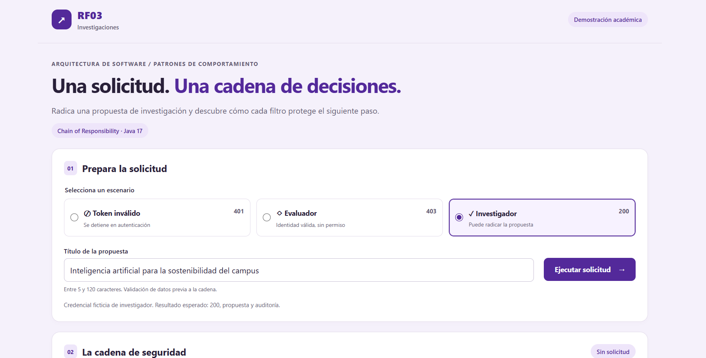
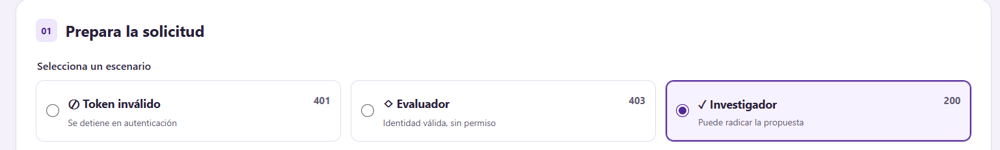
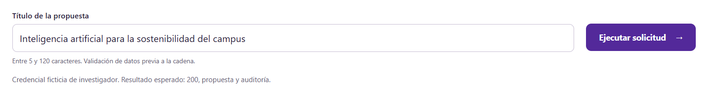
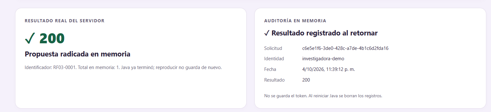
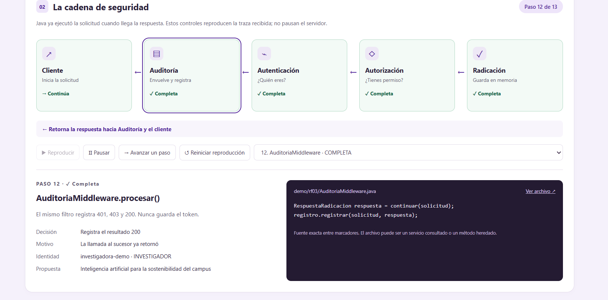

# RF03 · Chain of Responsibility en seguridad

Prototipo académico para radicar una propuesta de investigación. **RF03 corresponde aquí al dominio de investigaciones.** Java ejecuta la cadena y entrega una traza estructurada; el navegador reproduce los eventos recibidos y muestra sus fragmentos Java.

**No es seguridad para producción.** Token, permisos, persistencia de propuestas y auditoría se simulan. No hay conexión con un SSO, una universidad, una base de datos ni servicios reales. Las reglas son supuestos ilustrativos, no requisitos institucionales verificados. No se requieren cuentas ni claves.

## Inicio rápido

Requisito: **JDK 17**, con `java -version` y `javac -version` funcionando. Configure `JAVA_HOME` con la carpeta del JDK si fuera necesario. No incluya `bin` en esa variable. Maven se descarga con el Wrapper; no necesita instalarlo por separado.

Descomprima el ZIP y abra una terminal en la carpeta `rf03-chain` que contiene `pom.xml`.

Windows (PowerShell):

```powershell
.\mvnw.cmd clean verify
java -jar .\target\rf03-chain-1.0.0.jar
```

macOS / Linux:

```bash
chmod +x mvnw
./mvnw clean verify
java -jar target/rf03-chain-1.0.0.jar
```

Abra **http://localhost:8080**. Alternativa equivalente: `./mvnw spring-boot:run` o `.\mvnw.cmd spring-boot:run`. Detenga el servidor con Ctrl+C. La aplicación escucha solo en `127.0.0.1`; el diseño móvil puede revisarse con las herramientas de dispositivo del navegador.

La primera compilación descarga Maven 3.9.11 y las dependencias desde Maven Central. Después, `java -jar` no necesita Internet: HTML, CSS, JavaScript compilado, fuentes Java y diagramas son locales. Para recompilar usando únicamente la caché use `./mvnw -o clean verify` (Windows: `.\mvnw.cmd -o clean verify`), después de haber completado una compilación online. No abra `index.html` directamente: la interfaz utiliza la API del servidor.

Puerto ocupado: `java -jar target/rf03-chain-1.0.0.jar --server.port=8081`, y abra http://localhost:8081. Si el Wrapper pierde el permiso de ejecución al extraer en Linux/macOS, use el comando `chmod` anterior. En Windows se necesita PowerShell para la descarga inicial del Wrapper.

**Estado de verificación de esta entrega:** TypeScript compiló y las comprobaciones estáticas pasaron. Este entorno no dispone de Java/Maven, no permite descargar dependencias ni abrir sockets, y bloquea el arranque de Chromium. Por ello las pruebas JUnit, la compilación Java, el servidor, los escenarios en navegador y la revisión visual móvil están **pendientes**; no se incluye un JAR sin compilar. Consulte [docs/VERIFICACION.md](docs/VERIFICACION.md). `clean verify` compila, prueba y genera el JAR en un entorno con JDK y acceso inicial a Maven Central.

## Los tres escenarios


| Selección | Token ficticio de demostración | Identidad validada en Java | Resultado | Propuesta | Auditoría |
|---|---|---|---|---|---|
| Token inválido | `DEMO-INVALIDO` | Ninguna | 401 | No | Sí; autorización y radicación omitidas |
| Evaluador | `DEMO-EVALUADOR` | evaluador-demo / EVALUADOR | 403 | No | Sí; radicación omitida |
| Investigador | `DEMO-INVESTIGADOR` | investigadora-demo / INVESTIGADOR | 200 + RF03-0001… | Sí | Sí |

Edite el título (5 a 120 caracteres tras quitar espacios exteriores). La validación de datos ocurre **antes de iniciar la cadena**, tanto en el cliente web como en `ClienteRadicacion`. Datos inválidos devuelven 400 y no producen auditoría de seguridad. JSON malformado o con campos desconocidos también devuelve 400 en el adaptador HTTP. Esto se distingue del rechazo 401/403 de los filtros.

**200 se usa únicamente para mantener coherencia con los escenarios didácticos**, no como decisión de diseño de una API de producción. El código central devuelve un resultado con código numérico; el controlador lo transforma en estado HTTP.

## Patrón, clases y configuración

```text
ClienteRadicacion
  → AuditoriaMiddleware
      → AutenticacionMiddleware
          → AutorizacionMiddleware
              → RadicarPropuestaHandler
  ← respuesta, con trabajo de auditoría al retornar
```

| Participante | Clase real | Papel |
|---|---|---|
| Client | `ClienteRadicacion` | Crea un contexto por petición, valida título e invoca `cabeza.procesar` |
| Handler | `ManejadorSeguridad` | Contrato abstracto `procesar`; referencia final `siguiente`; delegación `continuar` |
| ConcreteHandler | `AuditoriaMiddleware` | Envuelve al sucesor y registra su respuesta |
| ConcreteHandler | `AutenticacionMiddleware` | Valida token ficticio, establece identidad o responde 401 |
| ConcreteHandler | `AutorizacionMiddleware` | Consulta permiso usando la identidad validada o responde 403 |
| ConcreteHandler | `RadicarPropuestaHandler` | Terminal con sucesor nulo: registra en memoria y devuelve 200 |
| Composición | `ConfiguracionCadena` | Construye la cadena completa en un único método |
| Adaptador HTTP | `RadicacionController` | Traduce entrada/salida sin implementar decisiones de seguridad |

Esta es una **variante de CoR como middleware**: varios filtros pueden participar y continuar. Cada filtro decide si delega. El rechazo devuelve un resultado sin invocar al sucesor. Auditoría es un filtro envolvente: invoca al sucesor y registra después de que la llamada retorna. No equivale a que solo un manejador atienda toda la solicitud.

`ValidadorTokenSimulado` contiene la tabla ficticia de identidades. `PoliticaPermisosSimulada` permite radicar únicamente a INVESTIGADOR. El DTO HTTP solo acepta `token` y `titulo`: el navegador no envía roles; un campo `rol` desconocido devuelve 400. Los perfiles proceden del validador Java. El manejador terminal es el único que usa `guardar`, por lo que una petición rechazada no registra una propuesta.

`SolicitudRadicacion` conserva identidad y traza por petición. `EventoTraza` es una instantánea inmutable sin token. `RespuestaRadicacion` es el resultado del dominio. Los repositorios en memoria son compartidos y admiten solicitudes concurrentes; una nueva solicitud no reutiliza el contexto ni la traza de la anterior. Los registros se relacionan por UUID de solicitud, no por la última posición de una lista global.

### Por qué importa el orden

Auditoría debe preceder a los filtros que rechazan para observar 401 y 403. Si se ubicara después de Autenticación, los tokens inválidos no llegarían a ella. Autenticación precede a Autorización para que la política opere con una identidad validada. Radicación debe quedar después de ambos filtros: anticiparla permitiría crear propuestas antes de comprobar el permiso. El orden se revisa en `ConfiguracionCadena`, sin un bloque de decisiones en el controlador.

### Añadir un filtro

Cree una subclase de `ManejadorSeguridad`, reciba el sucesor en el constructor, implemente `procesar` y devuelva un rechazo o `continuar(solicitud)`. Inserte la nueva instancia en `ConfiguracionCadena` antes del sucesor elegido. No cambie las clases de los filtros existentes. Por ejemplo, un filtro didáctico de horario iría después de Autorización y antes de Radicación.

Para exponer el nuevo filtro en este laboratorio también añada su nodo a `index.html`, sus eventos y marcadores de fuente, las pruebas y su representación UML. Esto amplía la presentación; no requiere modificar el algoritmo de los filtros previos.

## Interfaz y traza


La petición se procesa completamente en Java antes de entregar el JSON. La interfaz etiqueta la reproducción como tal; pausar **no detiene el servidor**. El resultado real y el registro ya están disponibles mientras se reproduce la traza.

- **Reproducir / Pausar:** avanzan o detienen únicamente el temporizador local.
- **Avanzar un paso:** consume el siguiente evento recibido.
- **Reiniciar reproducción:** vuelve al comienzo de la traza sin hacer otra petición ni crear otra propuesta.
- **Selector de eventos:** permite inspeccionar cualquier evento de la traza recibida.
- **Eslabón:** permite volver a su último evento ya visto; un nodo pendiente no inventa un paso.

Los estados tienen iconos y texto: pendiente, ejecutando, continúa, rechaza, completa y no ejecutado. Las flechas cambian a retorno en los eventos `RETORNO`. `marcarNoEjecutados` produce en Java eventos informativos `OMISION`, recorriendo las referencias al sucesor **sin llamar a `procesar`**. Las pruebas distinguen omisión de ejecución. El método de un evento omitido es `marcarNoEjecutados`, aunque el nombre del nodo sea el manejador omitido.

Los fragmentos se extraen en Java, con `FragmentosFuente`, entre comentarios `@fragment ...:start/end`. Maven empaqueta **los mismos `.java` compilados** como recursos locales. No hay copias mantenidas a mano ni números de línea ficticios. Cuando un evento corresponde a un servicio consultado o a `continuar` heredado, el panel muestra el archivo de ese método. Los fragmentos pueden abarcar una decisión completa; no representan una ejecución línea por línea ni un depurador.

Las etiquetas de los estados y los tokens precargados son configuración visual; JavaScript no decide si autentica, autoriza ni radica. Se utiliza `textContent` para mostrar datos y código. La interfaz usa fuentes del sistema, navegación por teclado y foco visible. Con `prefers-reduced-motion` no inicia la reproducción automáticamente y elimina las transiciones. En móvil la cadena es vertical.

## Estructura

```text
pom.xml, mvnw, mvnw.cmd, .mvn/wrapper/   Configuración y Wrapper oficial
src/main/java/demo/rf03/               Patrón, simuladores y adaptador HTTP
src/main/resources/static/             HTML, CSS, TypeScript y JS compilado
src/main/resources/static/uml/         Diagramas SVG y fuentes PlantUML locales
src/test/java/demo/rf03/                Pruebas JUnit / Mockito / HTTP real
src/main/resources/application.properties
  servidor local; rechazo de campos JSON desconocidos
docs/                                 UML, referencias y estado de verificación
tools/                                Generación UML, verificaciones y empaquetado
outputs/                              ZIP generado; JAR solo si se compiló
```

## Diagramas y fuentes

Desde la interfaz abra la sección UML. Las vistas SVG se pueden abrir en otra pestaña y ampliar; las fuentes `.puml` son editables y descargables. También están en `docs/`. Los atributos/métodos fundamentales, herencia y referencia al sucesor corresponden a las clases reales; los constructores, getters completos y records anidados se abrevian expresamente para legibilidad.

`tools/generar_uml.py` genera PlantUML y las vistas SVG desde un modelo común. Los SVG son una representación local trazada por ese script, **no una renderización realizada por PlantUML**. Las fuentes PlantUML detallan las dependencias adicionales de datos y apoyo. El diagrama de secuencia cubre las tres alternativas y la llamada común a `registrar` después del retorno. La validación previa se identifica fuera de la cadena.

## Pruebas y desarrollo

`./mvnw clean verify` o `.\mvnw.cmd clean verify` ejecuta:

- `CadenaTest`: escenarios 401/403/200, auditoría, invocaciones observadas mediante spies, eslabones omitidos, identidad del validador, ausencia de tokens en traza, aislamiento secuencial y concurrente, token ausente y validación de título.
- `HttpTest`: servidor Spring en puerto aleatorio, estados HTTP y cuerpo/traza, recursos locales, rechazo de rol arbitrario y JSON inválido.

Informes: `target/surefire-reports/`. Un fallo en pruebas impide `verify`. No use `-DskipTests` para verificar la entrega.

No hay compilación frontend separada requerida para iniciar o compilar el proyecto: `app.js` ya está incluido. `app.ts` es su fuente, compilada con TypeScript **5.9.3**, configuración `tsconfig.json`. Si modifica TypeScript, regenere con `tsc -p tsconfig.json` usando esa versión y conserve ambos archivos. Esta herramienta es opcional para desarrollo y no se descarga ni ejecuta al arrancar la aplicación.

Para volver a generar UML, si modifica su modelo: `python3 tools/generar_uml.py` (Windows con Python: `py tools/generar_uml.py`). Para empaquetar fuentes: `python3 tools/empaquetar.py`. Python tampoco es un requisito de ejecución del prototipo.

Se incluye `tools/verificar_interfaz.mjs` para ejecutar los tres escenarios **contra Java real**, comprobar controles y anchos 320/375/414/768/1280 con Playwright cuando esté disponible. Es opcional y requiere Node y Playwright de desarrollo (`npm install --no-save playwright`, `npx playwright install chromium` y `node tools/verificar_interfaz.mjs` con Java iniciado). No intercepta ni simula `/api`. No se ha podido ejecutar en esta entrega.

## API local para inspección

- `POST /api/radicaciones`: JSON `{"token":"DEMO-INVESTIGADOR","titulo":"Propuesta de investigación"}`. Devuelve estado 200/401/403, resultado, UUID, auditoría de esa solicitud y traza; 400 para datos inválidos.
- `GET /api/propuestas`: propuestas en memoria.
- `GET /api/auditoria`: registros en memoria, sin tokens.
- `/codigo/demo/rf03/ConfiguracionCadena.java`: fuente de la composición empaquetada.

Las rutas de inspección y de fuentes están abiertas **para esta demostración local**.

## Limitaciones

No se verifican firmas, caducidad, revocación ni transporte protegido de tokens. No existe autorización institucional, protección CSRF, rate limiting, transacciones ni almacenamiento durable. No hay garantía de auditoría frente a excepciones inesperadas o caída del proceso: la envoltura registra las respuestas normales 401/403/200 del ejemplo. Se mantienen listas en memoria sin límite, apropiadas para una exposición corta; reinicie el proceso para vaciarlas. La simulación no evita radicaciones repetidas; cada nueva petición exitosa crea otra propuesta. Si se pierde una respuesta de red tras guardar, consulte las rutas de inspección antes de reenviar.

No se requieren recursos remotos durante la demostración. Las referencias externas son documentación y no se cargan en la interfaz.

## Referencias

Compatibilidad verificada en la [documentación oficial de Spring Boot 3.5](https://docs.spring.io/spring-boot/3.5/system-requirements.html): mínimo Java 17 y Maven 3.6.3. La versión fijada de esta entrega es Spring Boot 3.5.16; Maven 3.9.11 supera el mínimo. Más referencias verificables y procedencia del Wrapper en [docs/REFERENCIAS.md](docs/REFERENCIAS.md), incluyendo bibliografía consultada para el estudio de este patrón.

Esta solución es un ejemplo a más profundidad de este patrón en Java; se apoya con los labs y ejemplos más generales (y en más lenguajes) presentes en el siguiente repositorio: https://github.com/Crisiszzz07/LAB_architectural-design-patterns (o se puede consultar desde la página: https://chainofresponsibility.vercel.app/)
